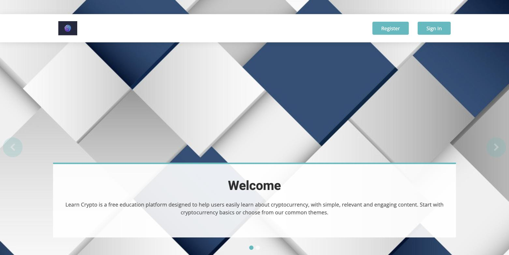
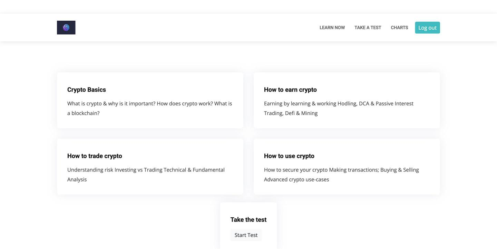
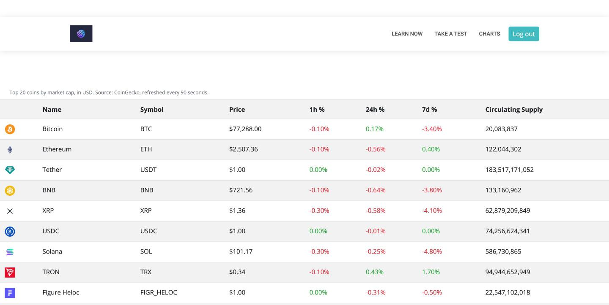
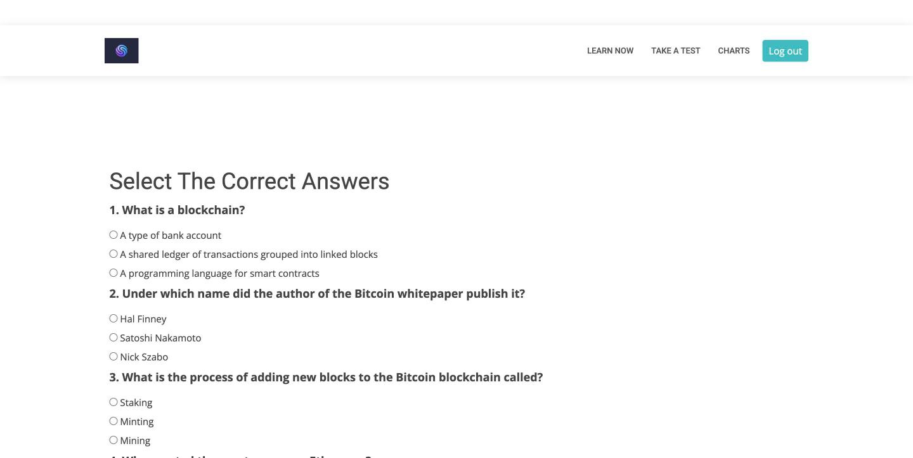
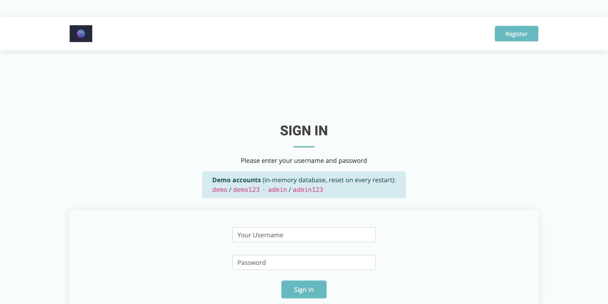

# Learn Crypto

[](https://github.com/MartinStefanov20/learnCrypto/actions/workflows/ci.yml)


[](LICENSE)

A crypto-basics learning site: four short courses (basics, earning, trading, using crypto),
a server-graded quiz and a live top-20 market table fed by the CoinGecko API. Built with Java 21
and Spring Boot 3 with Thymeleaf and Bootstrap, Spring Security for accounts, a cached market-data
client with an offline fallback, JUnit 5 tests, a non-root container image and a GitHub Actions
pipeline to Google Cloud Run.

**Live demo:** https://learncrypto-42945051810.europe-west3.run.app

| Account | Username | Password   | Roles                   |
|---------|----------|------------|-------------------------|
| Demo    | `demo`   | `demo123`  | `ROLE_USER`             |
| Admin   | `admin`  | `admin123` | `ROLE_ADMIN`, `ROLE_USER` |

Accounts live in an in-memory H2 database and are re-seeded on every start.

## Features

- **Courses** - four Thymeleaf pages covering what a blockchain is, how to earn, trade and spend crypto.
- **Quiz** - five random questions per round; answers are graded **server-side** and the correct
  option never leaves the server.
- **Market table** - top 20 coins by market cap with price, 1h/24h/7d change, market cap and
  supply. Data comes from CoinGecko's free `/coins/markets` endpoint, cached for 90 s (Caffeine).
  If the API is down or rate-limited the page shows a bundled snapshot and a clear "stale" banner.
- **Accounts** - registration with validation, form login, CSRF protection, concurrent-session
  registry, role-based access rules.
- **Ops** - `/actuator/health` for Cloud Run probes, everything else behind login.

Not included, on purpose: there is no trading simulator, portfolio tracker or wallet - this is a
learning site, not a finance product.

## Screenshots

| | |
|---|---|
| **Home** | **Dashboard** — courses and the quiz entry point |
|  |  |
| **Charts** — top 20 coins from CoinGecko, cached 90 s, offline fallback | **Quiz** — five random questions, graded server-side |
|  |  |
| **Login** — demo accounts shown on the page | |
|  | |

## Run locally

Requirements: JDK 21. Maven is provided through the wrapper.

```bash
./mvnw spring-boot:run
# with the H2 web console at http://localhost:8080/h2 (JDBC URL jdbc:h2:mem:learncrypto, user sa)
./mvnw spring-boot:run -Dspring-boot.run.arguments=--spring.profiles.active=local
```

Open <http://localhost:8080> and sign in with one of the demo accounts. `PORT` overrides the
listening port (`PORT=8091 ./mvnw spring-boot:run`).

Optional environment variables:

| Variable             | Purpose                                                                    |
|----------------------|----------------------------------------------------------------------------|
| `COINGECKO_API_KEY`  | CoinGecko *demo* API key; sent as `x-cg-demo-api-key` for a higher rate limit. Not required. |
| `COINGECKO_BASE_URL` | Override the API base URL (defaults to `https://api.coingecko.com/api/v3`). |

## Tests

```bash
./mvnw -B verify
```

| Test class                   | What it checks                                                                 |
|------------------------------|--------------------------------------------------------------------------------|
| `web/SecurityRulesTest`      | Anonymous users are redirected to login; assets and `/actuator/health` are public; `/actuator/env` is not reachable; `/charts` works when logged in |
| `web/LoginFlowTest`          | Demo/admin form login redirects to `/home` with the right roles; bad credentials are forwarded to `/users/login-error`; POST without CSRF token is rejected |
| `service/QuizScoringTest`    | All correct, all wrong, skipped counts as wrong, unknown question ids are ignored |
| `service/CoinGeckoClientTest`| JSON mapping to `MarketCoin`, 5xx and empty responses fall back to the bundled snapshot with `stale=true`, API-key header only when configured (`MockRestServiceServer`, no network) |

## Docker

```bash
docker build -t learncrypto:local .
docker run --rm -p 8080:8080 learncrypto:local
curl -s localhost:8080/actuator/health   # {"status":"UP"}
```

The image is built in three stages: Maven build (`eclipse-temurin:21-jdk`, BuildKit cache for
`~/.m2`), Spring Boot layer extraction, and an `eclipse-temurin:21-jre-alpine` runtime that runs as
an unprivileged user. During the build the application is started once with
`-XX:ArchiveClassesAtExit` and `-Dspring.context.exit=onRefresh` to produce an **AppCDS** archive
with the exact JVM that later runs it. Measured locally (Apple Silicon, colima): about 1.25 s to
"Started" with the archive versus 1.78 s without, with roughly 15,000 classes loaded from the
shared archive. The JVM is tuned for a 512 MiB / 1 vCPU container (SerialGC, C1 only, 70 % RAM).

## Deploy

Pushes to `main` build and deploy to Cloud Run (`europe-west3`) through
`.github/workflows/deploy-cloud-run.yml` using Workload Identity Federation. For the one-time
GCP setup and a manual first deploy see [docs/DEPLOY.md](docs/DEPLOY.md).

## Project structure

```
src/main/java/dev/mstefanov/learncrypto
├── config/        SecurityConfig (SecurityFilterChain), beans (ModelMapper, BCrypt, caching)
├── model/         JPA entities (User, Role, Course, Article, Question) and form binding models
├── repository/    Spring Data JPA repositories
├── service/       CoinGeckoClient + MarketCoin/MarketSnapshot, QuizService, UserService, ...
├── web/           HomeController, UserController, QuizController, ChartsController
└── ApplicationInit  seeds demo users, courses and quiz questions at start-up
src/main/resources
├── templates/     Thymeleaf pages
├── static/assets/ CSS, JS, images
├── data/markets-fallback.json   offline market snapshot
└── application*.properties      defaults + "local" profile (H2 console)
src/test/java      MockMvc, unit and RestClient slice tests
Dockerfile, .github/workflows, docs/DEPLOY.md
```

## License

[MIT](LICENSE) - Copyright (c) 2026 Martin Stefanov.
